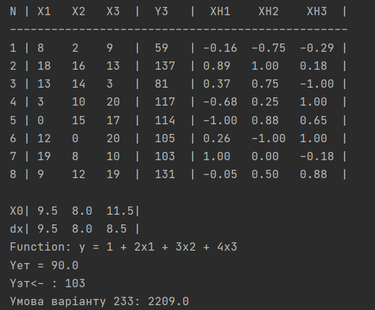

# Лабораторна робота №1

***Група ІО-93***

***Варіант 19***

**Завдання**

**Результати виконання**

**Додаткові питання:**

***1. З чого складається план експерименту?***

План експерименту складається з усіх точок плану(точка плану – один набір конкретних значень усіх К факторів). План експерименту описується матрицею, яка містить N  рядків та К стовпців, кожен рядок означає точку плану експерименту, а кожен стовпець – фактор експерименту.

***2. Що називається спектром плану?***

Спектром плану називається сукупність усіх точок плану, що відрізняються рівнем хоча б одного фактора(різні рядки матриці планування). Матриця, отримана із усіх різних рядків плану, називається матрицею спектра плану.

***3. Чим відрізняються активні та пасивні експерименти?***

В активному експерименті ми самі є адміністраторами нашої системи(параметри керовані і контрольовані), а в пасивному експерименті ми не можемо втручатися у хід проведення експерименту і виступаємо у ролі пасивного користувача(параметри контрольовані, але некеровані).

***4. Чим характеризуєься об’єкт досліджень? Дайте визначення факторному простору.***

Об’єкт дослідження розглядається як «чорний ящик». Характеризується вектором змінних величин, які називають факторами та залежністю реакції об’єкта від точки факторного простору - функцією відгуку. Факторний простір  - простір незалежних змінних(факторів), діапазон значень факторів.
